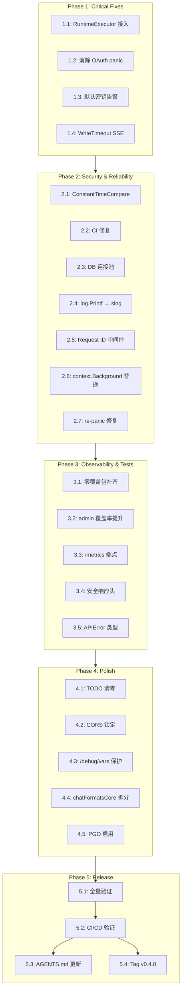

# Dependency Graph — Production Hardening

> **Status: historical / superseded** (pre-v0.4 hardening era). Not an open board.



## Parallel Execution Lanes

| Phase | Lane A | Lane B | Merge Risk |
|-------|--------|--------|------------|
| P1 | 1.1 + 1.2 + 1.3（不同文件） | 1.4（app.go + upstream.go） | 🟢 Low |
| P2 | 2.1 + 2.2 + 2.3 + 2.4 | 2.5 + 2.6 + 2.7 | 🟡 Med（auth+ci+store vs oauth+scheduler） |
| P3 | 3.1 + 3.2（测试文件） | 3.3 + 3.4 + 3.5（新中间件 + metric） | 🟢 Low |
| P4 | 4.1 + 4.2 + 4.3 | 4.4 + 4.5（transform + Dockerfile） | 🟢 Low |
| P5 | Sequential | — | — |

## Critical Path

```
1.1 → 2.x → 3.x → 4.x → 5.1 → 5.2 → 5.4
```

Tasks 1.1（RuntimeExecutor 接入）是最高优先级的单项修复——它修复所有 proxy 路径的超时问题，且是后续测试的基础。
