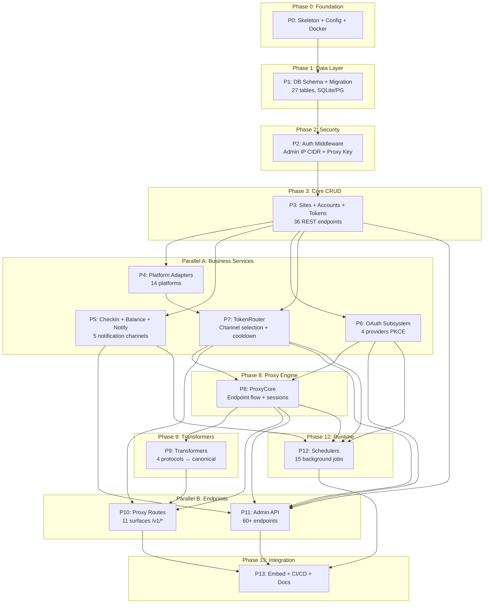

# Dependency Graph — MetAPI Go Rewrite

> **Status: historical rewrite-era graph**. Counts and package names are archival; living map is `docs/architecture.md`.

## Parallel Execution Lanes

| Lane | Phases | Can run together? |
|------|--------|-------------------|
| **Foundation** | P0 → P1 → P2 → P3 | Sequential (hard deps) |
| **Parallel A** | P4, P5, P6, P7 | ✅ 可同时推进 (不同文件, 最小 merge conflict) |
| **Proxy Engine** | P8 → P9 | Sequential |
| **Parallel B** | P10, P11 | ✅ 可同时推进 (不同 handler 目录) |
| **Schedulers** | P12 | After Parallel A + Proxy Engine |
| **Integration** | P13 | After all |

## Merge Risk Assessment

| Parallel Group | Files Touched | Merge Risk |
|:---|:---|:---|
| P4 + P5 + P6 + P7 | `platform/`, `service/checkin/`, `service/oauth/`, `routing/` | 🟢 Low — 不同子目录 |
| P10 + P11 | `handler/proxy/`, `handler/admin/` | 🟢 Low — 不同子目录 |
